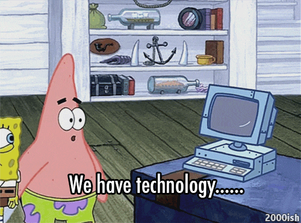

# Dá pra pesquisar o Caribe do Brasil? Reflexões teórico-metodológicas

[Eric Brasil](https://linktr.ee/ericbrasil) (IHL/UNILAB)

---

[TOC]

## 1. Pesquisa: do carnaval carioca ao Canboulay caribenho à História Digital

- **A Corte em Festa**: experiências negras em carnavais do Rio de Janeiro (1879-1888). Editora Prismas, 2016.

- **Carnavais atlânticos**: cidadania e cultura negra no pós abolição. Rio de Janeiro e Port-of-Spain, Trinidad (1838-1920), Tese de doutorado, UFF, 2016 - [Link](https://www.historia.uff.br/stricto/td/1806.pdf)

- História digital: reflexões a partir da Hemeroteca Digital Brasileira e do uso de CAQDAS na reelaboração da pesquisa histórica. - [Link](http://bibliotecadigital.fgv.br/ojs/index.php/reh/article/view/79933)

---

## 2. Arquivos, Métodos e História Digitais

### _Há diferença entre pesquisar no arquivo e no computador?_

### E agora? O que fazer com isso?

> OS CUIDADOS COM ARQUIVOS DIGITAIS DEVEM SER TÃO RIGOROSOS QUANTO COM OS ARQUIVOS FÍSICOS = **HEURÍSTICA DIGITAL!**
>
> E MAIS:
>
> 	- REGISTRAR TODOS OS PARÂMETROS DE BUSCA;
> 	- ATENTAR PARA OS METADADOS;
> 	- AVALIAR FORMATOS, RECURSOS, ETC

---

## 3. Vamos aos acervos

- [Periódicos Capes](https://www-periodicos-capes-gov-br.ezl.periodicos.capes.gov.br/index.php?)
  - Gale Primary Sources e o "sumiço de fontes".
- [Internet Archive](https://archive.org/)
- [FamilySearch](https://www.familysearch.org/search/catalog)
- [Digital Library of the Caribbean](https://dloc.com/)
- [Early Caribbean Digital Archive](https://ecda.northeastern.edu/)
- [Biblioteca Digital Puertorriqueña](https://upr.contentdm.oclc.org/digital/)
- [Census of Cuba 1899](https://digital.library.sc.edu/collections/report-on-the-census-of-cuba-1899/)
- [Cuban Law & Government](https://merrick.library.miami.edu/cdm/search/collection/cubanlaw)
- [Cuban Heritage Collections - University of miami](https://merrick.library.miami.edu/digitalprojects/chc.php)
- [Former British Colonial Dependencies, Slave Registers, 1813-1834](https://www.ancestry.co.uk/search/collections/1129/)
- [Haiti Collection](https://archive.org/details/jcbhaiti)
- [The Vodou Archive](https://ufdc.ufl.edu/vodou/all)
- [Library of Congress](https://www.loc.gov/)

---

## 4. Links

- [Quem tem medo dos métodos digitais de pesquisa?](https://www.youtube.com/watch?v=x-SGWbuYTZQ&t=1374s), Congresso virtual da UFBA 2020.

<iframe width="560" height="315" src="https://www.youtube.com/embed/x-SGWbuYTZQ" frameborder="0" allow="accelerometer; autoplay; clipboard-write; encrypted-media; gyroscope; picture-in-picture" allowfullscreen></iframe>

- [Emancpações e Pós-Abolição: História Pública e ensino de História nas mídias sociais.](https://youtu.be/y9M2NQszLNc) Webinar Gtep, 2020.

<iframe width="560" height="315" src="https://www.youtube.com/embed/y9M2NQszLNc" frameborder="0" allow="accelerometer; autoplay; clipboard-write; encrypted-media; gyroscope; picture-in-picture" allowfullscreen></iframe>

- [Condições de produção da história em tempos digitais: experimentação e práticas híbridas](https://youtu.be/0fc0fLeWlU4)

<iframe width="560" height="315" src="https://www.youtube.com/embed/0fc0fLeWlU4" frameborder="0" allow="accelerometer; autoplay; clipboard-write; encrypted-media; gyroscope; picture-in-picture" allowfullscreen></iframe>

- [Emancipações, pós-abolição e racismo no Brasil](https://youtu.be/NXuFrYz24IU), UEMG, 2020.
  
<iframe width="560" height="315" src="https://www.youtube.com/embed/NXuFrYz24IU" frameborder="0" allow="accelerometer; autoplay; clipboard-write; encrypted-media; gyroscope; picture-in-picture" allowfullscreen></iframe>

- [Inteligência artificial e humanidades, UNIFAL](https://youtu.be/kW26mFyH6vk), 2020.
  
<iframe width="560" height="315" src="https://www.youtube.com/embed/kW26mFyH6vk?start=1863" frameborder="0" allow="accelerometer; autoplay; clipboard-write; encrypted-media; gyroscope; picture-in-picture" allowfullscreen></iframe>

- Oficina: HISTORIADORES RODANDO PYTHON!? Uma Introdução
  
  - [Apresentação](https://ericbrasiln.github.io/oficina-python/)
  - [Vídeo](https://youtu.be/-6IGMyw7c6E)
  
  <iframe width="560" height="315" src="https://www.youtube.com/embed/-6IGMyw7c6E" frameborder="0" allow="accelerometer; autoplay; clipboard-write; encrypted-media; gyroscope; picture-in-picture" allowfullscreen></iframe>
  
- [The Programming Historian](https://programminghistorian.org/en/)

- [Laboratório de Humanidades Digitais da UFBA (LABHD-UFBA)](http://www.labhd.ufba.br/)

- [Wiki de Ferramentas Digitais (LARHUD e LABHDH-UFBA)](http://www.larhud.ibict.br/index.php?title=Ferramentas)

- [Mestrado em Humanidades Digitais da UFRRJ](https://www.dcc.ufrrj.br/ppgihd/)

---

## 5. Contatos

* E-mail: ericbrasiln@protonmail.com

* <a href="https://twitter.com/ericbrasiln" target="_blank">Twitter - @ericbrasiln</a>

- <a href="https://studio.youtube.com/channel/UC-tuyLIm7Ww_TDjKdHdnaAg/videos" target="_blank">Canal do YouTube</a>

* <a href="https://ericbrasiln.github.io/" target="_blank">Site</a>
* <a href= "https://github.com/ericbrasiln/" target="_blank">Github</a>
* [Linktree](https://linktr.ee/ericbrasil)

---

## Licença

GNU GENERAL PUBLIC LICENSE v.3.0

2020 Eric Brasil

 

